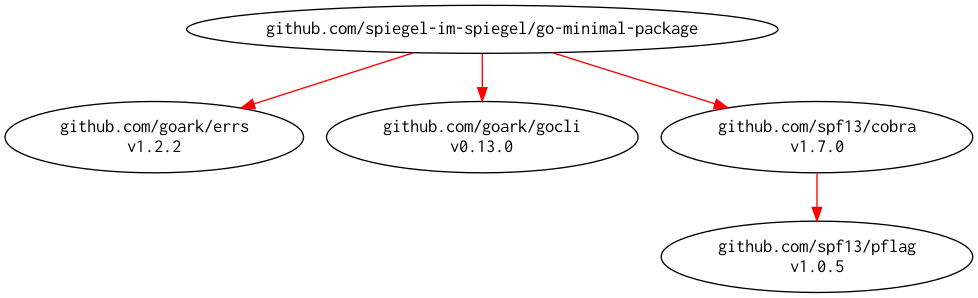

# go-minimal-package -- Minimal package for development of Go

[](https://github.com/spiegel-im-spiegel/go-minimal-package/actions)
[](https://github.com/spiegel-im-spiegel/go-minimal-package/actions)
[](https://github.com/spiegel-im-spiegel/go-minimal-package/actions)
[](https://raw.githubusercontent.com/spiegel-im-spiegel/go-minimal-package/master/LICENSE)
[](https://github.com/spiegel-im-spiegel/go-minimal-package/releases/latest)

This package is required Go 1.16 or later.

## Build and Install

```
$ go install github.com/spiegel-im-spiegel/go-minimal-package@latest
```

## Binaries

See [latest release](https://github.com/spiegel-im-spiegel/go-minimal-package/releases/latest).

## Usage

```
$ go-minimal-package -h
Usage:
  go-minimal-package [flags]
  go-minimal-package [command]

Available Commands:
  help        Help about any command
  version     Print the version number

Flags:
  -h, --help   help for go-minimal-package

Use "go-minimal-package [command] --help" for more information about a command.
```

## Modules Requirement Graph

[](./dependency.png)

[go-minimal-package]: https://github.com/spiegel-im-spiegel/go-minimal-package "spiegel-im-spiegel/go-minimal-package: Minimal package for development of Go"
